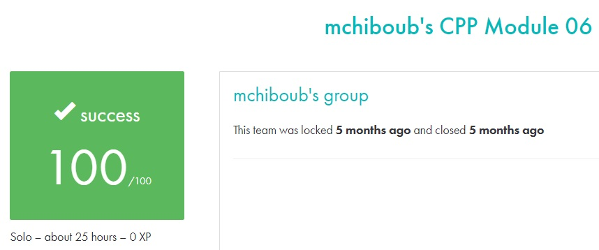

# C++ module 06 #

## What the project does: ##
The C++ - Module 06 project focuses on C++ type casting. It includes exercises that cover scalar type conversion, serialization of data structures, and identifying the real type of an object through casting. You will implement static methods to convert data between different types and practice type recognition in C++.

## Why the project is useful: ##
This project is useful because it deepens your understanding of type casting in C++, a critical aspect of memory management and polymorphism. It teaches how to safely and efficiently convert between different types and manage object types dynamically, which is essential for complex C++ applications.

[Subject of this project](en.subject.pdf)